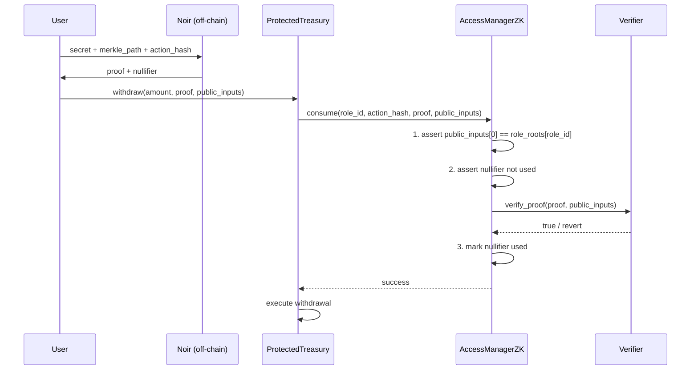

# Architecture: AccessManager ZK

## Overview

AccessManager ZK decouples **authorization from identity**. Instead of `assert(caller == authorized_address)`, contracts call `manager.consume(role_id, proof, public_inputs)` — which verifies a zero-knowledge proof of Merkle membership.

---

## End-to-End Flow



---

## Component Breakdown

### 1. Noir Circuit (`circuits/src/main.nr`)

Proves two statements in zero-knowledge:

| Statement | How |
|-----------|-----|
| Membership | `hash(secret)` is a leaf in the Merkle tree with root `root` |
| Action binding | `nullifier == hash(secret, action_hash)` |

**Public inputs** (visible on-chain): `root`, `action_hash`, `nullifier`  
**Private inputs** (never revealed): `secret`, `merkle_path[4]`, `path_indices[4]`

Hash function: **Poseidon BN254** (ZK-friendly, efficient on Starknet)

---

### 2. AccessManagerZK (`contracts/src/access_manager.cairo`)

The core protocol contract. Stateless design: any DApp becomes its own role admin.

**Storage:**
```
role_roots: Map<felt252, felt252>   // role_id → Merkle root
nullifiers: Map<felt252, bool>      // nullifier → used?
verifier_address: ContractAddress   // pluggable verifier
```

**Key design:** `set_role_root` uses `get_caller_address()` as the `role_id`. This means any contract that calls `set_role_root(root)` automatically owns its own role — no separate admin setup required.

---

### 3. Verifier (`contracts/src/verifier.cairo` / `mock_verifier.cairo`)

Pluggable interface. Two implementations:

| Contract | Usage |
|----------|-------|
| `MockVerifier` | Demo & testing — accepts any non-empty proof |
| `Groth16Verifier` | Production — generated via `nargo codegen-verifier` |

---

### 4. ProtectedTreasury (`contracts/src/protected_treasury.cairo`)

Reference DApp integration. Demonstrates:
- Constructor takes `access_manager_addr` + `owner`
- `setup_role_root(root)` — owner registers authorized user set (treasury calls the manager, making itself the role admin)
- `withdraw(amount, proof, public_inputs)` — protected function gated by ZK proof
- Replay protection is automatic via AccessManagerZK's nullifier tracking

> [!NOTE] 
> **Future Work (OpenZeppelin Integration):** The current `ProtectedTreasury` contract uses a bespoke, simplistic `owner` storage variable and internal `balance` accounting for demonstration purposes. In a production environment, this contract will be refactored to seamlessly inherit from **OpenZeppelin's `Ownable`** component for standardized access control on the `setup_role_root` function, and **OpenZeppelin's `ERC20`** component for managing real token deposits and withdrawals. These components were omitted from the initial V1 testnet deployment to prioritize deploying the core ZK proof verification logic within hackathon time constraints.

---

## Role ID Convention

The `role_id` is the **treasury's own contract address** (stored as `felt252`). This flows through as follows:

1. Treasury calls `manager.set_role_root(root)` → AccessManager stores `role_roots[treasury_addr] = root`
2. On `withdraw`, treasury calls `manager.consume(treasury_addr, action_hash, ...)` → AccessManager looks up `role_roots[treasury_addr]`

This self-sovereign pattern means each DApp controls its own role independently.

---

## Data Flow: Public Inputs

```
public_inputs = [root, action_hash, nullifier]
                  [0]       [1]         [2]
```

AccessManagerZK validates:
- `public_inputs[0]` == `role_roots[role_id]` (correct authorized set)
- `public_inputs[1]` == `action` parameter (prevents cross-action replay)
- `public_inputs[2]` not in `nullifiers` map (prevents replay)
